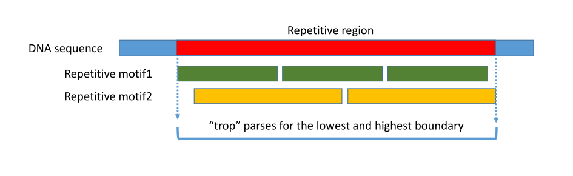

# TROP : Tandem Repeat Overlap Parser

# Why this script?

```trop``` was written following observations of artifactual sequences made entirely of tandem repeats in nanopore sequences (Sauvage et al. 2023). In seeking to characterize and quantify this sequencing noise, we used a classic tool known as Tandem Repeats Finder (```trf```, Benson 1999).

The problem is that ```trf``` reports multiple overlapping tandem boundaries for a given repetitive region. This is due to the imperfect nature of repetitive DNA and the period of the detected repetitive motif linked to ```trf``` parameters. Note that sequencing errors may also affect the detection of these boundaries. 

**```trop``` parses for the LOWEST and HIGHEST boundary of a repetitive region**



```trop``` can parse the output of ```trf``` that is produced from any ```fasta``` file containing tandem. However, here, we are more focussed on long raw sequence reads (nanopore, pacbio) or even assembled contigs.

```trop``` was initially written in R but rewritten in perl for efficiency and operating system compatibility.  

# Prerequisites
**1) Running ```trf``` to produce a ```.dat``` file**

For the present tutorial, ```trf``` was run with the following options on a ```fasta``` file of R9.4 nanopore reads (```NA_all.fasta```, not provided)

```trf NA_all.fasta 2 5 7 80 10 50 2000```, which produces ```NA_all.fasta.2.5.7.80.10.50.2000.dat```

If you open this provided example file in a simple text editor, results are displayed sequences by sequences as shown below:

```
Tandem Repeats Finder Program written by:

Gary Benson
Program in Bioinformatics
Boston University
Version 4.09


Sequence: e387a9f8-ebed-4d86-81a1-087c17c96745 runid=e3cf134550fca3678f03a505c0ce5509328f672c sampleid=no_sample read=36148 ch=109 start_time=2022-04-05T03:45:24Z model_version_id=2021-05-17_dna_r9.4.1_minion_


Parameters: 2 5 7 80 10 50 2000


59 185 52 2.4 54 79 11 168 28 14 25 30 1.95 CTTTCTGTTGGTGCTGATATTGCTGAAAATAGAGCGACAGGCAAGAGACAATAT CTTTCTGTTGGTGCTGATGGCTTGAAAATAGAGCGACAGGCAAGAGACAATATCTTTCATTGGTATGATATTGCTGAAGATAGAGCGACAGGCAAGACAATATCTTTCTGTTGGTGCAGATATTGCT


Sequence: d80c3c51-9115-419c-a8cf-3245e320a981 runid=e3cf134550fca3678f03a505c0ce5509328f672c sampleid=no_sample read=11233 ch=120 start_time=2022-04-04T14:00:13Z model_version_id=2021-05-17_dna_r9.4.1_minion_

...
```


Please visit ```trf```'s github repository for further information on ```trf``` installation, running and output options (https://github.com/Benson-Genomics-Lab/TRF)

**2) Preparing a tabulated sequence length file**

There are a number of ways this can be done, for instance, you could use the ```awk``` command below (one-liner) on linux platform from the raw nanopore reads in ```fasta``` (below as ```NA_all.fasta```, file not provided):

```
awk '/^>/{if (l!="") print l; print; l=0; next}{l+=length($0)}END{print l}' NA_all.fasta | cut -d ' ' -f 1 | paste - - | sed -r 's/^>//g' > NA_all_tabulated_lengths.txt
```

Note that here, we split the nanopore sequence very long titles to only keep the main identifier and we output a file named ```NA_all_tabulated_lengths.txt```. 

The resulting tabulated file format is as below. The first column is the sequence name, the second column is the sequence length in bp.

```
80800063-c64b-4493-a80c-6e2c6bfbe01a	823
a9fc5d29-acd8-4858-81c0-5cf6434708c0	894
66c1ef31-ac67-447a-ad27-4fdb74f47c74	2845
9cbcb1ea-5ae0-4333-a6f6-fcca75430742	3096
12ede4c6-f934-4566-bdd3-dc0e8efa004b	4402
3fa38391-78fc-47de-927d-1b806dc12ac9	456
7a5fe376-fa8b-4552-8803-04015cab89bd	2961
...
```
This format is important to match that of sequence names produced by the parsing of the ```.dat``` file by ```trop```.


# Running TROP

Install ```perl``` version 5 or newer

Open your terminal (on windows, macos or linux)

Indicate the directory where you placed the above files (or drag and drop the directory to the terminal window, which will fill the path automatically). 

Here an example path indicated in windows command prompt.

```
cd C:/Users/tomsauv/my_analyses
```
Run the following command with the example files:
```
perl trop_v7.pl NA_all.fasta.2.5.7.80.10.50.2000.dat NA_all_tabulated_lengths.txt
```

# File output

```trop``` produces three output files:

```1_tandem_locations.txt```

This file reports the location of each tandem region, thus multiple entries per read may occur.

The tandem location is reported for both of the 5' edge (positive values) and 3' edge (as negative values) for plotting purposes.   

```
seqname	trgroup	trlength	seqlength	trprop	start_5prime	stop_5prime	start_3prime	stop_3prime
000ab28b-db24-4ee5-83d2-10d8fcd7a5e4	1	250	484	51.65	192	442	-43	-293
000ceda9-b66a-430c-9d0e-213c598e62c2	1	297	1793	16.56	1445	1742	-52	-349
0010bd89-2875-4da9-ac68-630723a64513	1	346	688	50.29	29	375	-314	-660
0010bd89-2875-4da9-ac68-630723a64513	2	173	688	25.15	454	627	-62	-235
0018a571-bd9c-4cce-9caf-267c782a4a49	1	260	2228	11.67	31	291	-1938	-2198
0018a571-bd9c-4cce-9caf-267c782a4a49	2	547	2228	24.55	330	877	-1352	-1899
0018a571-bd9c-4cce-9caf-267c782a4a49	3	91	2228	4.08	978	1069	-1160	-1251
0018a571-bd9c-4cce-9caf-267c782a4a49	4	59	2228	2.65	1108	1167	-1062	-1121
0018a571-bd9c-4cce-9caf-267c782a4a49	5	895	2228	40.17	1320	2215	-14	-909
...
```
```2_tandem_per_read.txt```

This file reports the total tandem regions per read (single entry per read)
```
seqname	ntrgroup	trlength	seqlength	trprop
000ab28b-db24-4ee5-83d2-10d8fcd7a5e4	1	250	484	51.65
000ceda9-b66a-430c-9d0e-213c598e62c2	1	297	1793	16.56
0010bd89-2875-4da9-ac68-630723a64513	2	519	688	75.44
0018a571-bd9c-4cce-9caf-267c782a4a49	5	1852	2228	83.12
...
```
```3_tandem_summary.txt```

This file reports the number of sequences containing detected tandem and overall tandem bp. Proportions are also computed.

e.g. below ~48% of sequences contained tandem and the detected tandem length represented >12% of total base pairs. 
```
class	nseq	nseq_perc	bp	bp_perc
No Tandem	12099	51.96	31589056	87.30
Tandem	11185	48.04	4593376	12.70
Total	23284	100.00	36182432	100.00
```

Fields meaning for the three files are as follows:

**seqname**: sequence name

**trgroup**: non-overlapping tandem region identifier in a sequence read/contig read (as increasing counts, e.g. region 1, 2, 3, etc)

**ntrgroup**: total number of non-overlapping tandem region in a sequence read/contig read

**trlength**: length of the reported tandem repeat region 

**seqlength**: length of the sequence read/contig

**trprop**: tandem repeat region proportion as compared to the read/contig total length

**start_5prime**: starting location of the tandem repeat region measured from the 5' edge

**stop_5prime**: stopping location of the tandem repeat region measured from the 5' edge

**start_3prime**: starting location of the tandem repeat region measured from the 3' edge (reported as a negative value)

**stop_3prime**: stopping location of the tandem repeat region measured from the 3' edge (reported as a negative value)

**nseq**: number of sequence reads/contigs

**nseq_perc**: percentage of sequence reads/contigs

**bp**: total base pairs for non-tandem or tandem repeat region

**bp_perc**: percentage of total base pairs counted for non-tandem and tandem repeat region

# Ideas

Aside from using this script to describe tandem content (see Figs and Tables in Sauvage et al. 2023), you could:

-Develop the script further to merge tandems separated by short distances (e.g. perhaps merge tandem separated by <100 bp, the best distance would have to be determined emprirically by using File 3). Such short distances may result from tandem detection issues or parameters.

-Create a tandem trimmer based on locations reported in File 3 (e.g. trim the 5' and 3' tandem edges of reads prior to assembly). Tandems found on edges of reads probably have little value for assembly.

-Use File 1 to filter out high tandem reads from raw fasta sequence prior to assembly (e.g. identify read labels with trprop 80-90% and exclude them from sequence files).

Finally, note that ```trf``` can output a ```fasta``` file in which all detected tandems are masked as NNNNs (on each read). If an assembler could accept such files and use that information to trim or correct sequences accordingly, it could be interesting.

# How to cite this script

Sauvage T, Cormic A, Passerini D (2023) **A comparison of Oxford nanopore library strategies for bacterial genomics.** _BMC Genomics_ 24:627 [DOI:10.1186/s12864-023-09729-z](https://doi.org/10.1186/s12864-023-09729-z)

or directly (after changing the date you accessed this repository)

Sauvage T. **TROP : Tandem Repeat Overlap Parser**. https://github.com/tomsauv/TROP-Tandem-Repeat-Overlap-Parser. Accessed October 18, 2023. [DOI:10.5281/zenodo.10019937](https://zenodo.org/doi/10.5281/zenodo.10019937).

[](https://zenodo.org/doi/10.5281/zenodo.10019937)

# Additional references

Benson G (1999) **Tandem Repeats Finder: a program to analyze DNA sequences**. _Nucleic Acids Research_ 27(2):573–580 [doi:10.1093/nar/27.2.573](https://doi.org/10.1093/nar/27.2.573)

